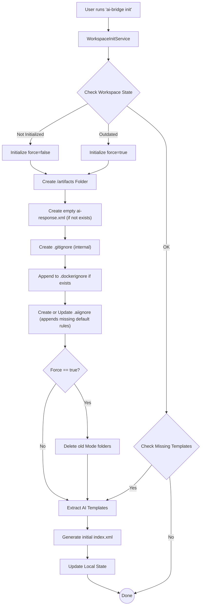
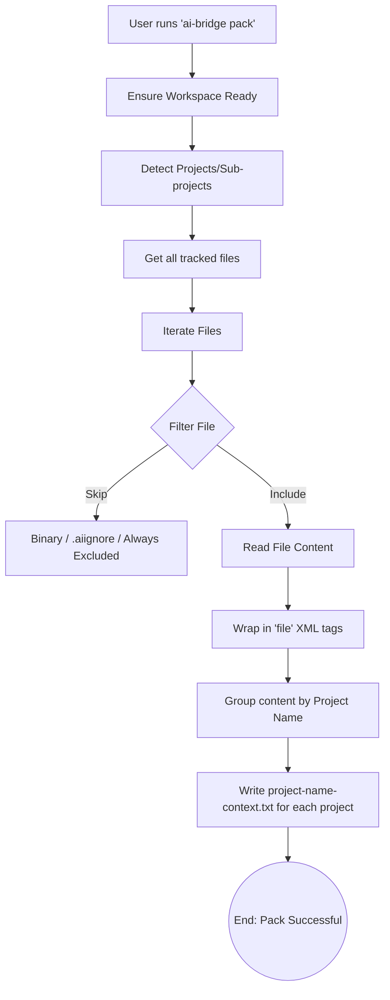
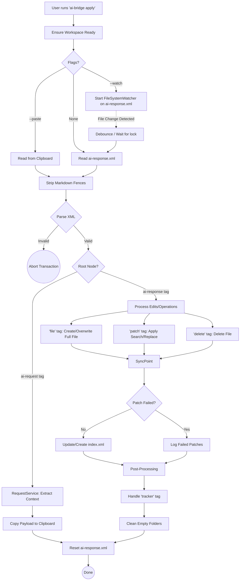

# AI Bridge CLI Workflows

This document visualizes the internal workflows of all `ai-bridge` CLI commands. It uses Mermaid flowcharts to illustrate the system state, decisions, and processes triggered by each command.

## 1. `init` Flow
The `init` command scaffolds the AI Bridge workspace for a new project, setting up ignores, templates, and the initial codebase index.

## 2. `pack` Flow
The `pack` command reads source files, respects ignore rules, and bundles the codebase into a single text context file suitable for AI consumption.

## 3. `apply` Flow
The `apply` command is the core engine for executing AI-generated instructions. It parses XML, applies code patches, manages files, and handles metadata indexing.

