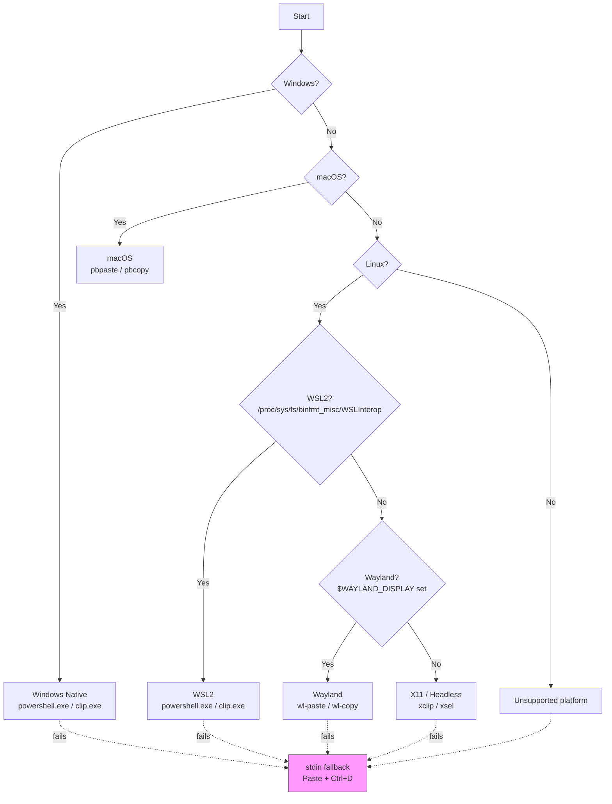

# Option C — Drop TextCopy, Native Clipboard for All Platforms (Implemented ✅)

## Platform Detection & Command Matrix

The helper detects the environment **once at startup** using this priority chain:



| Environment | Read (Paste) Command | Write (Copy) Command | Detection | Fallback |
|---|---|---|---|---|
| **Windows** | `powershell.exe -Command Get-Clipboard` | `clip.exe` (stdin) | `RuntimeInformation.IsOSPlatform(OSPlatform.Windows)` | stdin |
| **macOS** | `pbpaste` | `pbcopy` (stdin) | `RuntimeInformation.IsOSPlatform(OSPlatform.OSX)` | stdin |
| **WSL2 (interop on)** | `powershell.exe -Command Get-Clipboard` | `clip.exe` (stdin) | Linux + `/proc/sys/fs/binfmt_misc/WSLInterop` exists | stdin |
| **WSL2 (interop off)** | Falls through to X11 → fails | Falls through to X11 → fails | Detected as Linux/X11 (interop file absent) | **stdin** |
| **Linux (Wayland)** | `wl-paste --no-newline` | `wl-copy` (stdin) | Linux + `$WAYLAND_DISPLAY` is set | stdin |
| **Linux (X11)** | `xclip -selection clipboard -o` | `xclip -selection clipboard` (stdin) | Linux fallback (default) | stdin |
| **Headless / SSH** | N/A | N/A | Falls to X11 → fails | **stdin** |

---

## Full Implementation: `ClipboardHelper.cs`

Create this file at [AIBridge/ClipboardHelper.cs](file:///home/arpanvgm/github/arpanvgm/ai-bridge/AIBridge/ClipboardHelper.cs):

```csharp
using System;
using System.Diagnostics;
using System.IO;
using System.Runtime.InteropServices;

namespace AIBridge
{
    /// <summary>
    /// Zero-dependency clipboard access across Windows, macOS, Linux (X11/Wayland), and WSL2.
    /// </summary>
    public static class ClipboardHelper
    {
        private enum Platform { Windows, MacOS, Wsl2, LinuxWayland, LinuxX11, Unsupported }

        private static readonly Platform CurrentPlatform = DetectPlatform();

        private static Platform DetectPlatform()
        {
            if (RuntimeInformation.IsOSPlatform(OSPlatform.Windows))
                return Platform.Windows;

            if (RuntimeInformation.IsOSPlatform(OSPlatform.OSX))
                return Platform.MacOS;

            if (RuntimeInformation.IsOSPlatform(OSPlatform.Linux))
            {
                // WSL2 check — must come before Wayland/X11
                if (File.Exists("/proc/sys/fs/binfmt_misc/WSLInterop"))
                    return Platform.Wsl2;

                // Wayland check
                if (!string.IsNullOrEmpty(Environment.GetEnvironmentVariable("WAYLAND_DISPLAY")))
                    return Platform.LinuxWayland;

                // Default to X11
                return Platform.LinuxX11;
            }

            return Platform.Unsupported;
        }

        /// <summary>
        /// Reads text from the system clipboard. Returns null if clipboard is empty.
        /// </summary>
        public static string? GetText()
        {
            var (fileName, args) = CurrentPlatform switch
            {
                Platform.Windows => ("powershell.exe", "-NoProfile -Command Get-Clipboard"),
                Platform.MacOS   => ("pbpaste", ""),
                Platform.Wsl2    => ("powershell.exe", "-NoProfile -Command Get-Clipboard"),
                Platform.LinuxWayland => ("wl-paste", "--no-newline"),
                Platform.LinuxX11     => ("xclip", "-selection clipboard -o"),
                _ => throw new PlatformNotSupportedException(
                    "Clipboard access is not supported on this platform.")
            };

            return RunProcess(fileName, args);
        }

        /// <summary>
        /// Writes text to the system clipboard.
        /// </summary>
        public static void SetText(string text)
        {
            var (fileName, args) = CurrentPlatform switch
            {
                Platform.Windows => ("clip.exe", ""),
                Platform.MacOS   => ("pbcopy", ""),
                Platform.Wsl2    => ("clip.exe", ""),
                Platform.LinuxWayland => ("wl-copy", ""),
                Platform.LinuxX11     => ("xclip", "-selection clipboard"),
                _ => throw new PlatformNotSupportedException(
                    "Clipboard access is not supported on this platform.")
            };

            WriteToProcess(fileName, args, text);
        }

        /// <summary>
        /// Returns a human-readable name of the detected clipboard provider.
        /// Useful for diagnostics in error messages.
        /// </summary>
        public static string GetProviderName() => CurrentPlatform switch
        {
            Platform.Windows      => "Windows (powershell.exe / clip.exe)",
            Platform.MacOS        => "macOS (pbpaste / pbcopy)",
            Platform.Wsl2         => "WSL2 (powershell.exe / clip.exe)",
            Platform.LinuxWayland => "Linux/Wayland (wl-paste / wl-copy)",
            Platform.LinuxX11     => "Linux/X11 (xclip)",
            _                     => "Unsupported"
        };

        private static string? RunProcess(string fileName, string args)
        {
            var psi = new ProcessStartInfo
            {
                FileName = fileName,
                Arguments = args,
                RedirectStandardOutput = true,
                RedirectStandardError = true,
                UseShellExecute = false,
                CreateNoWindow = true
            };

            using var proc = Process.Start(psi)
                ?? throw new Exception($"Could not start '{fileName}'. Is it installed and in PATH?");

            var output = proc.StandardOutput.ReadToEnd();
            proc.WaitForExit();

            if (proc.ExitCode != 0)
            {
                var error = proc.StandardError.ReadToEnd().Trim();
                throw new Exception(
                    $"Clipboard read failed (exit code {proc.ExitCode}): {error}");
            }

            // Trim trailing newline that powershell/pbpaste may add
            return string.IsNullOrEmpty(output) ? null : output.TrimEnd('\r', '\n');
        }

        private static void WriteToProcess(string fileName, string args, string text)
        {
            var psi = new ProcessStartInfo
            {
                FileName = fileName,
                Arguments = args,
                RedirectStandardInput = true,
                RedirectStandardError = true,
                UseShellExecute = false,
                CreateNoWindow = true
            };

            using var proc = Process.Start(psi)
                ?? throw new Exception($"Could not start '{fileName}'. Is it installed and in PATH?");

            proc.StandardInput.Write(text);
            proc.StandardInput.Close();
            proc.WaitForExit();

            if (proc.ExitCode != 0)
            {
                var error = proc.StandardError.ReadToEnd().Trim();
                throw new Exception(
                    $"Clipboard write failed (exit code {proc.ExitCode}): {error}");
            }
        }
    }
}
```

---

## Changes to Existing Files

## Changes to Existing Files

### 1. [Applier.cs](file:///home/arpanvgm/github/arpanvgm/ai-bridge/AIBridge/Applier.cs) — Smart input source auto-detection

The `ApplyInternal` method now resolves input using a 3-tier fallback:

```
ai-bridge apply (no flags):
  1. ai-response.xml has real content (not placeholder)? → use it
  2. File is placeholder/missing? → try clipboard
  3. Clipboard fails/empty? → prompt stdin (reads until </ai-response> or </ai-request>)

ai-bridge apply --paste:
  1. Skip file check → try clipboard
  2. Clipboard fails/empty? → prompt stdin
```

The `--paste` flag is now optional — `ai-bridge apply` alone is smart enough to find the content.
The `SetText` call (ai-request flow) also uses ClipboardHelper with a graceful fallback to showing the file path.

### 2. [ClipboardHelper.cs](file:///home/arpanvgm/github/arpanvgm/ai-bridge/AIBridge/ClipboardHelper.cs) — New file

Includes `ReadXmlFromStdin()` which reads line-by-line and stops automatically when it sees the closing `</ai-response>` or `</ai-request>` tag. No Ctrl+D needed — just paste and Enter.

### 3. [AIBridge.csproj](file:///home/arpanvgm/github/arpanvgm/ai-bridge/AIBridge/AIBridge.csproj) — Remove TextCopy

```diff
-  <ItemGroup>
-    <PackageReference Include="TextCopy" Version="6.2.1" />
-  </ItemGroup>
```

No new NuGet packages needed. Uses only `System.Diagnostics.Process` and `System.Runtime.InteropServices.RuntimeInformation`, both built into .NET.

---

## Error Messages & Fallback Behavior

When the clipboard command is missing or fails, the user gets a **warning** and an automatic **stdin fallback** (for `--paste` reads):

| Platform | Likely Error | What User Sees |
|---|---|---|
| Linux/X11 | `xclip` not installed | ⚠ _"Could not access clipboard..."_ → stdin prompt |
| Linux/Wayland | `wl-clipboard` not installed | ⚠ _"Could not access clipboard..."_ → stdin prompt |
| WSL2 (interop off) | `xclip` fails (no display) | ⚠ _"Could not access clipboard..."_ → stdin prompt |
| WSL2 (interop on) | `powershell.exe` not in PATH (rare) | ⚠ _"Could not access clipboard..."_ → stdin prompt |
| Headless / SSH | No display server | ⚠ _"Could not access clipboard..."_ → stdin prompt |
| All (write fail) | Any `SetText` failure | ⚠ _"Could not copy to clipboard"_ + file path shown |
| All (stdin empty) | User sends EOF with no input | ❌ _"No content received"_ + suggests file-based flow |

---

## Testing Checklist

| # | Test | Expected |
|---|---|---|
| 1 | `ai-bridge apply --paste` on **Windows** | Reads from clipboard via PowerShell |
| 2 | `ai-bridge apply --paste` on **macOS** | Reads from clipboard via `pbpaste` |
| 3 | `ai-bridge apply --paste` on **WSL2 (interop on)** | Reads from Windows clipboard via `powershell.exe` |
| 4 | `ai-bridge apply --paste` on **WSL2 (interop off)** | Clipboard fails → falls back to stdin prompt |
| 5 | `ai-bridge apply --paste` on **Linux (X11)** with `xclip` installed | Reads via `xclip` |
| 6 | `ai-bridge apply --paste` on **Linux (X11)** without `xclip` | Clipboard fails → falls back to stdin prompt |
| 7 | `ai-bridge apply --paste` on **Linux (Wayland)** | Reads via `wl-paste` |
| 8 | `ai-bridge apply --paste` on **headless / SSH** | Clipboard fails → falls back to stdin prompt |
| 9 | `ai-request` flow with `--paste` on any platform | Context copied to clipboard; warns + shows file path on failure |
| 10 | `ai-bridge apply` (without `--paste`) | File-based flow unchanged, no clipboard calls |
| 11 | `ai-bridge apply --dry-run` | Preview mode unchanged, no clipboard calls |
| 12 | `ai-bridge apply --watch` | Watch mode unchanged, no clipboard calls |

---

## Summary

| Aspect | Before (TextCopy) | After (ClipboardHelper) |
|---|---|---|
| **NuGet dependencies** | TextCopy 6.2.1 | None |
| **Windows** | ✅ | ✅ |
| **macOS** | ✅ | ✅ |
| **Linux X11** | ✅ (needs xclip) | ✅ (needs xclip) |
| **Linux Wayland** | ⚠️ Partial | ✅ (needs wl-clipboard) |
| **WSL2 (interop on)** | ❌ Fails | ✅ Uses Windows clipboard bridge |
| **WSL2 (interop off)** | ❌ Fails | ✅ Falls back to stdin |
| **Headless / SSH** | ❌ | ✅ Falls back to stdin |
| **Binary size** | Includes TextCopy DLL | Smaller |
| **Code ownership** | External dependency | Fully in your control |
